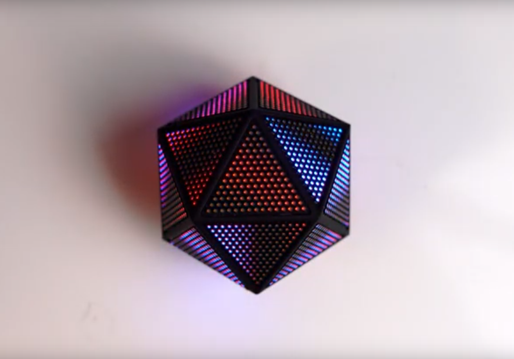
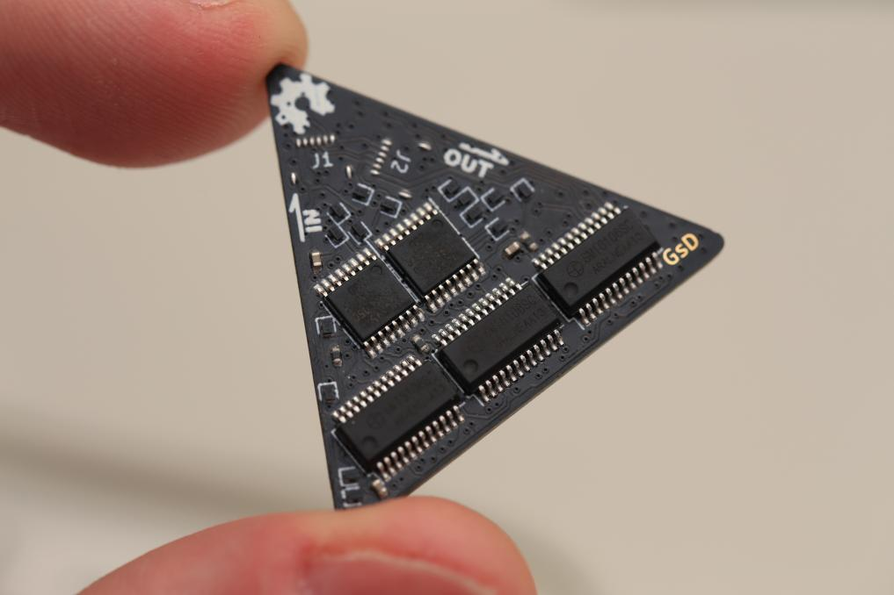

# d20-hardware
Hardware design files for the icosahedron d20 build.

Read the blog post to read more about the project: https://gregdavill.com/blog/d20

## Assembly BOM
 - 1x d20-control PCBA
 - 20x d20-tri PCBA
 - 20x 6P 0.5mm FFC, 50mm length, opposite side
 - 1x d20_enclosure_r0.1_001.stl
 - 1x d20_enclosure_r0.1_002.stl
 - 1x Sony NP-FW50 battery (knock-offs work fine)

## PCBs

Please use version r0.3 of the d20-tri boards, the earlier versions have severe errata.

